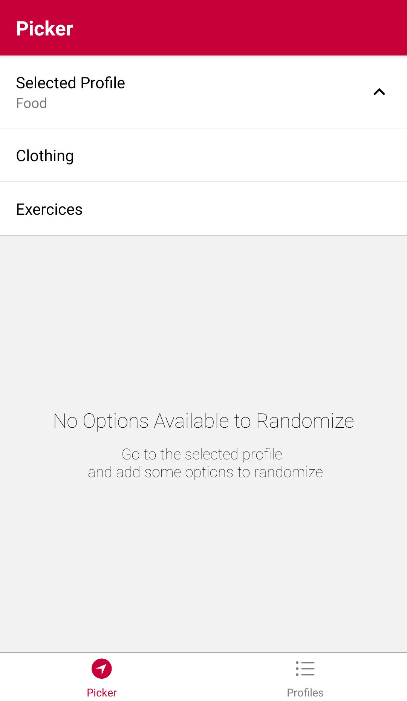
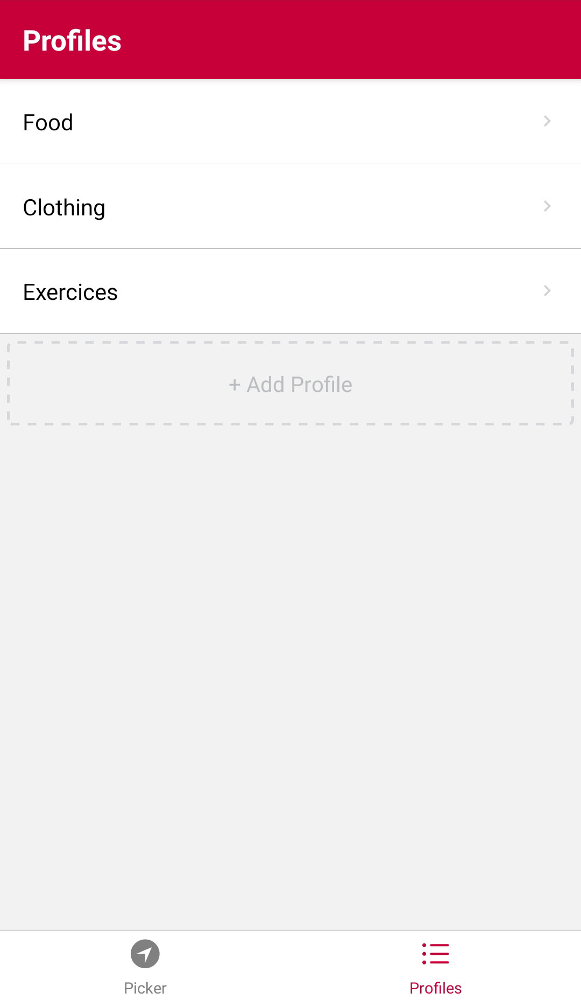
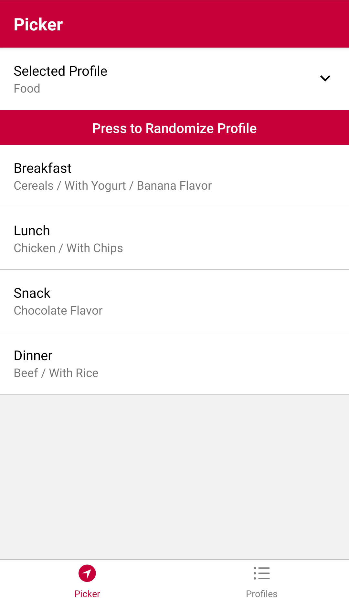

<p style="text-align: center">
  
</p>

# Life Random Generator

Easily randomize every aspect of your life! 

Dont know what to wear? Let the app decide from a pre-selected range of your favourite clothing.

Dont know what to eat? Let the app decide from a pre-selected range of your favourite food.

Your life, made easier!

<br>

## Screenshots








<br>

## Instal Expo-CLI
npm:

```sh
npm install --global expo-cli
```

Yarn:

```sh
yarn install --global expo-cli
```

<br>

## How to Run Locally

npm:

```sh
npm i
npm start
```

Yarn:

```sh
yarn i
yarn start
```

Run to your Android Emulator:

```sh
yarn run android 
```

<br>

## License

MIT © [Renato Pestana](https://gitlab.com/3nvy/)
